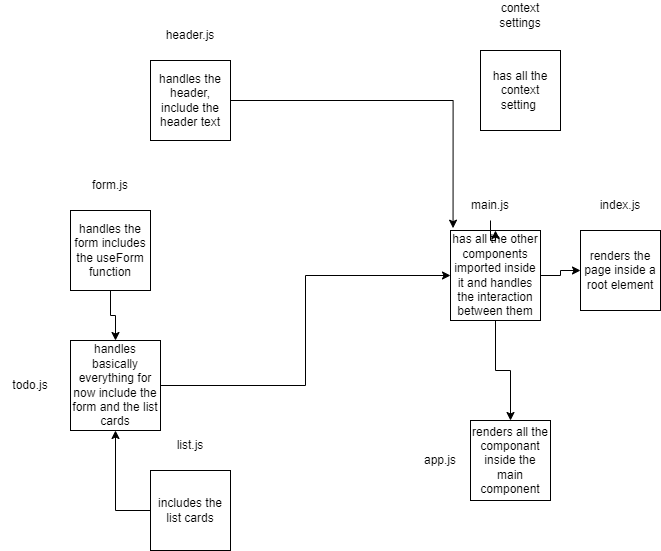

# Todo App

Todo App is a web application the enables the user to create a todo list and assign it to someone.

- phase 1: the base of todo app.
  - a user can add a new task
  - a user can assign that task to name
  - a user can sort the task by name or by completetion
  - a user can delete the task
  - a user is can display only the incompleted tasks

## UML
;

## [PR link](https://github.com/Mhsalameh/resty/pull/8);
## [live URL]