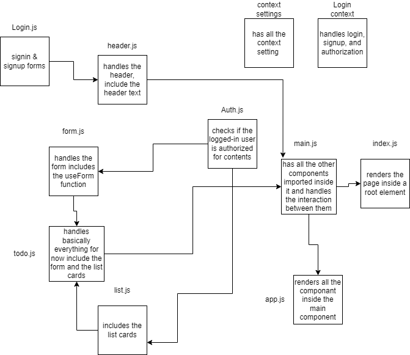

# Todo App

Todo App is a web application the enables the user to create a todo list and assign it to someone.

- phase 1: the base of todo app.

  - a user can add a new task
  - a user can assign that task to name
  - a user can sort the task by name or by completetion
  - a user can delete the task
  - a user is can display only the incompleted tasks

- phase 2: added local storage

  - a user can now save his current settings to use later on
  - a user save his to do list, and it will render even after refresh

- phase 3: added authorization and authentication
  - a user can now creat new users with different roles
  - a user can now log in with a signedup username and password
  - conneted to an authentication-api that handles signup and signin
  - a user with admin role can:
    - create a new task
    - delete the task
    - edit the completetion of the task
    - and read the available tasks
  - a user with editor role can:
    - create a new task
    - edit the completetion of the task
    - read the available tasks
  - a user wtih writer role can:
    - create a new task
    - read the available tasks
  - a user wtih user role can:
    - read the available tasks

## UML

;

## [PR link](https://github.com/Mhsalameh/todo-app/pull/8)

## [live URL](https://coruscating-marigold-6319f2.netlify.app/)

## How the global state is consumed by the components

- first we creat a settings context, using `react.createContext()`
- then we create the settings provider function and add all the setting sates in there using the useState() hook
- put all the states and their setters in a state object so we can call each of them by name
- finally we return using the settings context provider and pass the state object to it as value props ie.

```js
<SettingsContext.provider value={state}>
  {props.children}
</SettingsContext.provider>
```

- in the main component we will call the settings provider function and wrap it around all the components that we want to consume the global state

```jsx
<Settings>
  <Header />
  <Todo />
</Settings>
```

- all the components and their childrens will be consumers of the global states the the settings context provides.

## The operation of the hook `useForm()`

- `useForm()` is a costum hook the has handling functions, the hook takes a callback function as an argument, it will make sure the other operations run befor that callback function is called, like to handle events before passing the value, or to add new values before passing them to the function.
